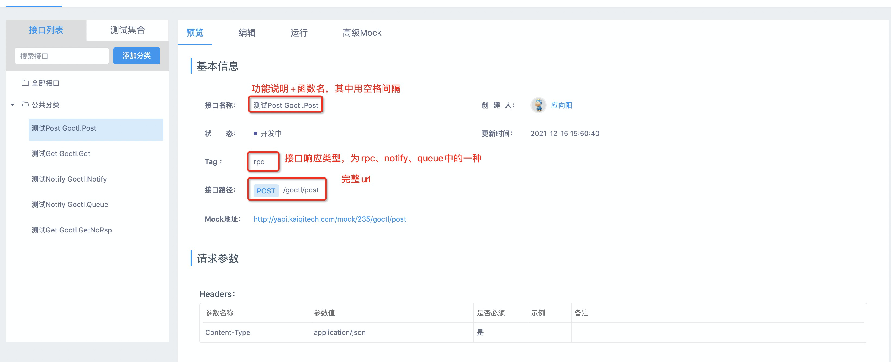
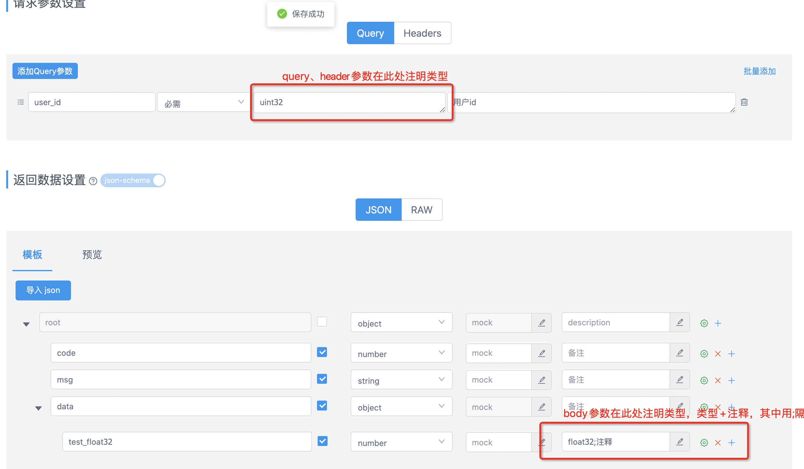
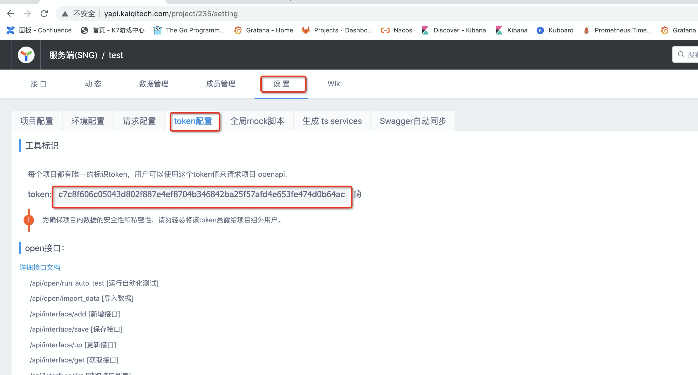
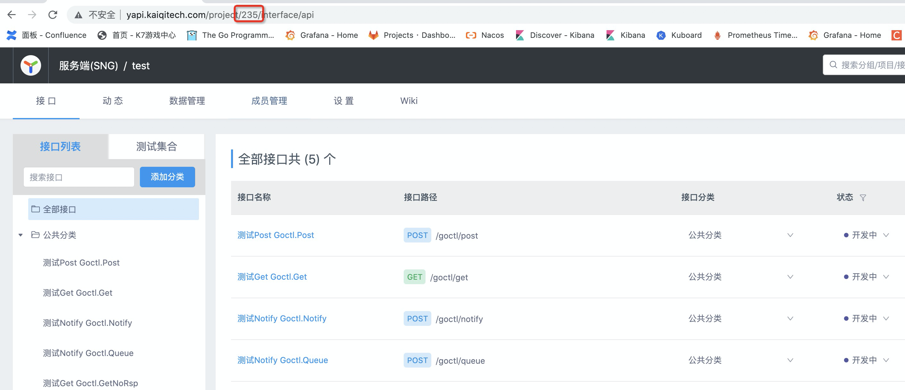
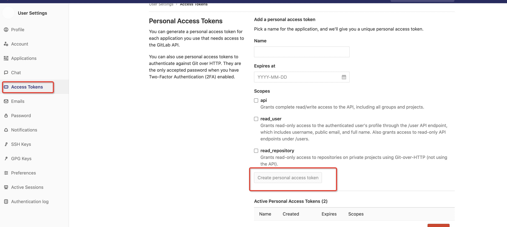

# goctl使用说明
## 安装
### 安装准备
* 按[文档](http://confluence.kaiqitech.com/pages/viewpage.action?pageId=67931038)配置go开发环境
* 申请[nitro](https://gitlab.kaiqitech.com/nitro/nitro.git)仓库权限

### 安装命令
安装master分支：`go get -u gitlab.kaiqitech.com/nitro/nitro/v3/goctl`
安装dev分支：`go get -u gitlab.kaiqitech.com/nitro/nitro/v3/goctl@dev`

### 自更新命令
`goctl upgrade [-branch/-b dev]`
> -branch/-b 指定代码分支，默认为master

## api
根据yapi文档生成相应代码文件

### yapi文档编写规范



### 获取yapi项目token及id
在使用api命令时需要用到yapi项目的token及id，获取方式如下。
获取yapi项目token:

获取yapi项目id:


### api create sng service
根据yapi项目生成sng服务代码
`goctl api create-sng-service [-token/-t token] [-project projectId] [-api apiId] [-name/-n name]`
> -token/-t  yapi项目鉴权token
> -project yapi项目projectId
> -api yapi接口id
> -name/-n 指定服务名

生成目录如下:
```Plain Text
    .
    ├── logic (逻辑代码目录)
    │   ├── api.go (配置api endpoint)
    │   └── goctl.go (逻辑结构体及其函数)
    |
    └── models (model代码目录)
         └──apim (api model代码目录)
             ├── req.go (请求结构体)
             └── resp.go (响应结构体)
```

### api create sng service test
根据yapi项目生成sng服务代码
`goctl api create-sng-service-test [-token/-t token] [-project projectId] [-api apiId] [-name/-n name]`
> -token/-t  yapi项目鉴权token
> -project yapi项目projectId
> -api yapi接口id
> -name/-n 指定要测试的服务名(注意也要以`-service`结尾)

生成目录如下:
```Plain Text
    .
    └── api (api测试代码目录)
         ├── init.go (初始化文件，用于初始化配置)
         └── test.go (接口测试文件，一个接口生成一个文件)
```

## chart
根据内置模版生成项目的chart配置文件
### chart create sng service
生成sng服务的chart配置
`goctl chart create-sng-service [-name/-n name] [-dir/-d dir] [-fold/-f fold]`
> -name/-n 服务名,可以指定多个服务名，之间用`,`分隔
> -dir/-d 生成目录
> -fold/-f 指定文件夹名字，如果不指定则默认使用服务名

## git

### 获取gitlab私有token


### git create sng service
配置sng服务的gitlab
`goctl git create-sng-service [-name/-n name] [-token/-t token] [-dec/-d dec]`
> -name/-n 服务名，只能指定一个服务名
> -token/-t gitlab token
> -dec/-d 项目描述，不指定则为空

* 此命令会同时创建dev、qa、master三个分支，配置各分支权限，设置默认分支为dev，并且添加自动构建的webhook
### git create sng service test
配置sng test的gitlab
`goctl git create-sng-service-test [-name/-n name] [-token/-t token] [-dec/-d dec]`
> -name/-n 服务名，只能指定一个服务名
> -token/-t gitlab ~~token~~
> -dec/-d 项目描述，不指定则为空

* 此命令会同时创建test、master三个分支，配置各分支权限，设置默认分支为test

### git get
根据关键字模糊查询项目地址
`goctl git get [-name/-n name] [-token/-t token]`
> -name/-n 服务名关键字
> -token/-t gitlab token

* 当有多个匹配结果时，对顺序不作保证

### git open
根据关键字模糊查询项目地址，然后使用浏览器打开
`goctl git open [-name/-n name] [-token/-t token]`
> -name/-n 服务名关键字
> -token/-t gitlab token

* 当有多个匹配结果时，随机打开一个

### git delete
根据关键字模糊查询项目地址，然后使用浏览器打开
`goctl git delete [-token/-t token] [-id id]`
> -token/-t gitlab token
> -id 项目id，可以指定多个，其间用`,`分隔，id可以通过`git open`命令获取

## jenkins
用于迅速配置项目的jenkins配置
### jenkins create sng service
配置sng服务的jenkins
`goctl jenkins create-sng-service [-name/-n name] [-user/-u user] [-pass/-p pass]`
> -name/-n 服务名，可指定多个服务名，其间用`,`分隔
> -user/-u jenkins用户名
> -pass/-p jenkins密码

* 此命令会同时配置Dev、Qa、Trunk的job，并且同时配置完其构建流水线

### jenkins update sng service
配置sng服务的jenkins
`goctl jenkins update-sng-service [-name/-n name] [-user/-u user] [-pass/-p pass]`
> -name/-n 服务名，可指定多个服务名，其间用`,`分隔
> -user/-u jenkins用户名
> -pass/-p jenkins密码

* 此命令会使用最新的内置模版同时更新服务的Dev、Qa、Trunk中的job

### jenkins delete sng service
配置sng服务的jenkins
`goctl jenkins delete-sng-service [-name/-n name] [-user/-u user] [-pass/-p pass]`
> -name/-n 服务名，可指定多个服务名，其间用`,`分隔
> -user/-u jenkins用户名
> -pass/-p jenkins密码

* 此命令会同时删除服务的Dev、Qa、Trunk中的job

## model
生成model层的代码
### sql
根据sql数据表结构生成go model代码
`goctl model sql [-url/-u url] [-node/-n node] [-db db] [-table/-t table] [-dir/-d dir] [-cache] `
> -url/-u 数据库url，不指定则默认使用内网数据库
> -node/-n 数据库节点名，默认为common
> -db db名
> -table/-t 表名，可指定多个表名，其间用`,`分隔
> -dir/-d 生成目录,默认为当前目录
> -cache 带有此标记则表示生成sql代码带有分布式缓存功能

* 生成model时必须确保网络能连上数据库
* 生成sql model代码可以根据需要删减字段已优化性能
* 如果db为yygsubshuangsheng，则会按游戏数据库模版生成

### redis
根据sql数据表结构生成go model代码
`goctl model redis [-node/-n node] [-table/-t table] [-dir/-d dir]`
> -node/-n 数据库节点名，默认为common
> -table/-t 表名，可指定多个表名，其间用`,`分隔，表名必须为大驼峰格式比如LoginInfo
> -dir/-d 生成目录,默认为当前目录

* 生成sql model代码后需要自己手动配置结构题字段

### mongo
根据sql数据表结构生成go model代码
`goctl model mongo [-node/-n node] [-db db] [-coll/-c coll] [-dir/-d dir]`
> -node/-n 数据库节点名，默认为common
> -db db名
> -coll/-c 集合名，可指定多个集合名，其间用`,`分隔
> -dir/-d 生成目录,默认为当前目录

* 结构体名字由coll名字转换而来

## project
一键配置项目
### project create sng service
一键配置sng服务及测试项目
`goctl project create-sng-service [-config/-c config]`
> -config/-c yaml配置文件，路径必须时相对路径

配置模版如下：
```yaml
# 服务名，不要带`-service`后缀
service_name: goctl
# 生成项目的路径，必须为相对路径，且必须以`/`结尾
service_dir: ./services/
service_test_dir: ./test/

gitlab_token: XXXXXXXX

yapi:
 # 项目id
 id: 235
 # 项目token
 token: c7c8f606c05043d802f887e4ef8704b346842ba25f57afd4e653fe474d0b64ac

jenkins:
 user: zwf@qipai007.com
 pass: XXXXXXXXXXXX

sql:
 -
  node: common
  db: yygplatform
  table: [userwealthbank]

redis:
 -
  node: common
  table: [NitroTest, GoctlTest]

mongo:
 -
  node: common
  db: goctl
  coll: [nitro_test, goctl_test]
```
配置流程先配置service项目，再配置test项目

配置service:
1. 生成service gitlab项目
2. 配置service jenkins项目
3. 拉取service gitlab项目至service_dir
4. 生成service 项目通用文件（main.go、.vscode、dockerfile等）
5. 根据yapi项目生成api相关代码
6. 根据数据库生成model代码
7. go mod拉取所有关联库并使用gofmt进行代码格式化
8. 提交所有修改并推送至service gitlab远程仓库

配置test:
1. 生成test gitlab项目
2. 生成test 项目通用文件（go.mod、gitignore等）
3. 根据yapi项目生成api相关测试代码
4. go mod拉取所有关联库并使用gofmt进行代码格式化
5. 提交所有修改并推送至service gitlab远程仓库

* 配置完项目后，项目应自动推至gitlab，且触发自动构建，并成功部署至k8s上

## deploy

> 部署Server到服务器

`goctl deploy -server/s server -env/-e env [-url/-u url] [-file/-f file] [-user user] [-password/-p password] [-identity_file -i identity_file]`

- -server/s 指定服务器类型, 可选值: conn/db/game/center/sync
- -env/-e 指定部署环境，可选值: dev/test/qa
- -url/-u 指定包路径，与-file/-f选项二选一
- -file/-f 指定本地包路径，格式需为tar.gz
- -user 指定服务器登录用户名
- -password/-p 指定服务器登录密码
- -identity_file/i 指定服务器登录密钥


## protok

> 对内部协议监控解析

### monitor

> 监控指定网络上的通信协议

`goctl protok monitor -server/-s server_addr -protocol/-p protocol [-heartbeat] [-filter/-f filter]`

- -server/-s 指定服务器地址，包含":"，例如: 127.16.1.155:9000
- -protocol/-p 指定通信协议，目前支持：连接服(conn)/游戏服(game)
- -heartbeat 解析心跳包
- -filter/-f 指定需要解析的协议，可指定多个。连接服(conn)/游戏服(game): -f 1002,10 -f 1002,1

